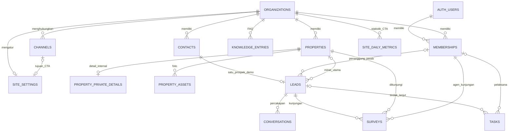
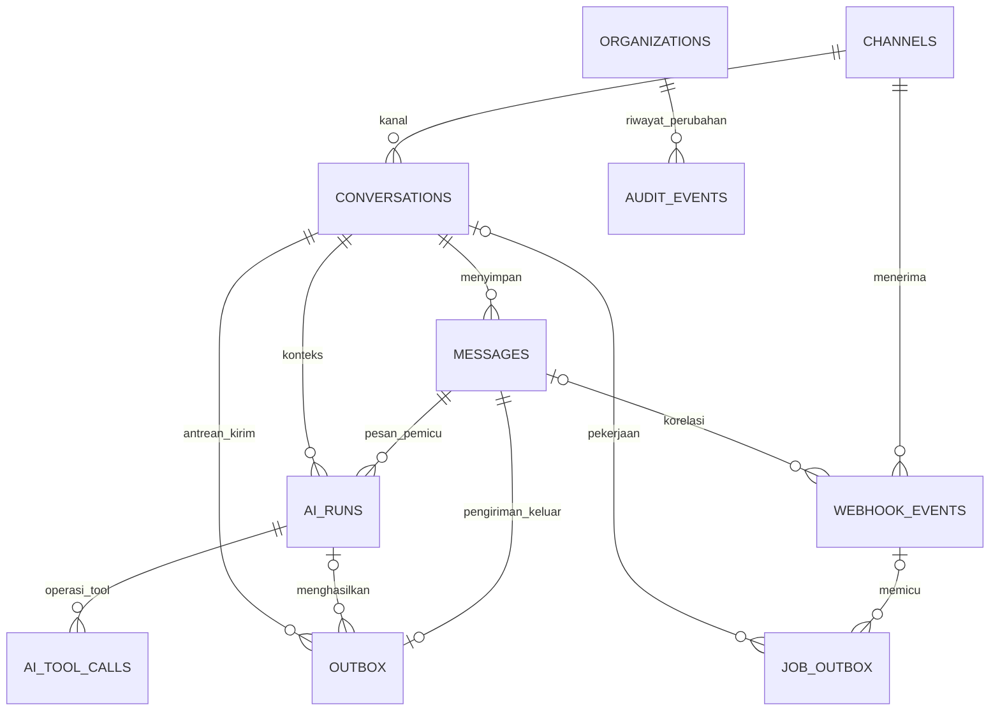

# Desain database — Website Agen dan AI Admin Properti

Tanggal: 3 Oktober 2026  
Status: rancangan logis dan aturan integritas; belum menjadi migrasi SQL yang dijalankan.  
Acuan: [plan shipping demo](roadmap.md).

Pasangan dokumen: [struktur folder](architecture.md).

## 1. Keputusan dasar

- Database: PostgreSQL di Supabase; akun/password dikelola Supabase Auth melalui `auth.users`.
- Satu organisasi mewakili satu klien agen/agensi. Demo memakai satu organisasi utama dan satu organisasi uji isolasi. Struktur organisasi tidak berarti aplikasi memiliki paket SaaS atau pendaftaran mandiri.
- Satu kontak memiliki satu prospek pada demo. Prospek dapat mempunyai satu percakapan per kanal; percakapan yang ditutup dibuka kembali saat kontak yang sama datang. Riwayat beberapa peluang penjualan per kontak dapat ditambahkan setelah demo.
- Assignment utama disimpan pada `leads.assigned_user_id`. Percakapan mengambil assignment dari lead; tidak ada salinan kolom assignment pada `conversations`.
- Website, AI, dan dashboard memakai katalog yang sama. Publikasi dan ketersediaan listing adalah dua status terpisah.
- Kontak dan prospek dibuat dari pesan masuk, bukan klik CTA. Pesan masuk simulator memakai identitas sintetis yang tidak bertabrakan dengan nomor WhatsApp.
- Terdapat **21 tabel aplikasi**: 17 entitas plan ditambah `site_settings`, `property_private_details`, `ai_tool_calls`, dan `site_daily_metrics`. Tambahan ini memisahkan konfigurasi website, data properti internal, idempotensi tool AI, serta metrik CTA. `auth.users` dan `storage.objects` dikelola Supabase dan tidak dihitung.

## 2. Konvensi kolom dan relasi

| Konvensi | Aturan |
| --- | --- |
| Identitas | Tabel record memakai `id uuid` sebagai PK dan `organization_id uuid NOT NULL` sebagai FK. Pengecualian PK disebutkan pada tabel terkait. |
| Waktu | `created_at` dan `updated_at` bertipe `timestamptz`; waktu kejadian disimpan sebagai timestamp absolut dan ditampilkan Asia/Jakarta. Event append-only cukup `created_at` ditambah waktu kejadian. |
| Nullable | Tanda `?` pada kolom/kelompok kolom berarti boleh NULL; kolom lain wajib terisi kecuali dijelaskan berbeda. |
| Status | `text` dengan `CHECK` terhadap nilai yang didaftarkan; perubahan status lewat service/RPC terkontrol. |
| Harga/budget | `bigint` rupiah bulat nonnegatif. Serialisasi ke UI memakai string desimal atau konversi yang memeriksa batas aman JavaScript. |
| Luas | `numeric(12,2)` dalam meter persegi; wajib positif jika terisi. |
| FK organisasi | Referensi bisnis memakai `(organization_id, referenced_id)` ke `(organization_id, id)`, bukan hanya FK ID global. |
| Referensi anggota | `(organization_id, assigned_user_id)` mengacu ke `memberships(organization_id, user_id)`. Keanggotaan aktif diperiksa saat tindakan dilakukan. |
| Penghapusan | Default `RESTRICT`/arsip untuk record bisnis. Cascade hanya untuk anak yang aman dihapus bersama parent, melalui prosedur reset/retensi yang jelas. |

Setiap tabel record menyediakan `UNIQUE (organization_id, id)` untuk FK gabungan. `organizations.id` adalah identitas organisasi itu sendiri. Tabel satu-baris-per-organisasi dan PK gabungan tidak menambahkan UUID yang tidak diperlukan. FK gabungan melindungi hubungan lintas organisasi bahkan ketika pemanggil mempunyai akses server tinggi. [Referensi constraint PostgreSQL](https://www.postgresql.org/docs/current/ddl-constraints.html)

## 3. ERD bisnis dan website

Diagram menampilkan hubungan utama. Semua tabel tenant juga mempunyai FK organisasi walaupun garis tersebut tidak diulang pada setiap anak agar diagram tetap terbaca.



## 4. ERD pesan, AI, dan pekerjaan



`JOB_OUTBOX` mengatur pekerjaan yang perlu dijalankan. `OUTBOX` mengatur request pengiriman pesan ke provider. Keduanya sengaja dipisahkan karena retry pekerjaan tidak selalu aman untuk mengulang request WhatsApp.

## 5. Tabel organisasi, website, dan katalog

### 5.1 `organizations`

PK `id uuid`. Tidak memiliki `organization_id` yang menunjuk dirinya sendiri.

| Kolom | Tipe / aturan |
| --- | --- |
| `name`, `slug` | `text`; slug unik global untuk identitas konfigurasi internal. |
| `timezone` | `text`, default `Asia/Jakarta`; demo hanya memakai nilai ini. |
| `is_demo` | `boolean`, default true untuk seed. |
| `default_sales_user_id?` | `uuid`; FK gabungan `(id, default_sales_user_id)` ke memberships. |
| `processing_paused` | `boolean`; dihormati dispatcher, worker, dan sender. |
| `processing_epoch` | `bigint`, default 1; naik saat reset untuk menolak pekerjaan lama. |

Membership dibuat sebelum menetapkan sales default. Jika default tidak aktif, lead menjadi unassigned dan terlihat pada antrean owner; sistem tidak menugaskan ke anggota agensi lain.

### 5.2 `memberships`

PK gabungan `(organization_id, user_id)`. `user_id uuid` mengacu ke `auth.users.id`.

| Kolom | Tipe / aturan |
| --- | --- |
| `role` | `text`: `owner`, `sales`. |
| `display_name` | `text`; nama tampilan anggota pada organisasi ini. |
| `is_active` | `boolean`; akun nonaktif kehilangan akses bisnis. |

Tidak menyimpan password. Perubahan role/keanggotaan melalui operasi owner/operator yang berizin; sales tidak dapat mengangkat dirinya menjadi owner. Pertahankan minimal satu owner aktif melalui transaksi pengelolaan anggota.

### 5.3 `site_settings`

PK/FK `organization_id`; maksimal satu konfigurasi website per organisasi.

| Kolom | Tipe / aturan |
| --- | --- |
| `brand_name`, `headline`, `about_text` | `text`; konten beranda/profil klien. |
| `canonical_origin` | `text`; origin HTTPS yang diverifikasi operator, unik untuk website ini. |
| `logo_path?`, `public_contact_text?` | `text`; hanya aset/kontak yang memang diizinkan publik. |
| `cta_channel_id?` | `uuid`; FK kanal dalam organisasi yang sama. |
| `seo_title`, `seo_description`, `privacy_text` | `text`; konten publik, tidak memuat secret. |
| `indexing_enabled` | `boolean`, default false; tetap false secara efektif jika organisasi demo. |

CTA aktif hanya jika kanal bertipe WhatsApp dan konfigurasinya siap. Nomor tujuan diambil dari `channels.public_phone_e164`; tidak disalin ke banyak halaman. Pada demo, label dan batas penerima uji tetap ditampilkan.

### 5.4 `properties`

| Kolom | Tipe / aturan |
| --- | --- |
| `public_code`, `slug` | `text`; masing-masing unik dalam organisasi, stabil setelah dipublikasikan. |
| `title`, `description`, `city`, `area` | `text`; informasi yang dapat ditampilkan kepada calon pembeli. |
| `public_address?` | `text`; alamat yang diizinkan publik, bukan otomatis alamat internal. |
| `price_rupiah` | `bigint`, nonnegatif. |
| `bedrooms`, `bathrooms` | `smallint`, nonnegatif. |
| `land_area_m2?`, `building_area_m2?` | `numeric(12,2)`, positif jika diisi. |
| `availability` | `text`: `active`, `paused`, `sold`. |
| `publication_status` | `text`: `draft`, `published`, `archived`. |
| `published_at?` | `timestamptz`; wajib untuk status published. |
| `seo_title?`, `seo_description?` | `text`; jika kosong, dibentuk dari field publik. |
| `created_by_user_id?`, `updated_by_user_id?` | `uuid`; anggota organisasi, nullable untuk seed/operator. |

Website dan tools AI pelanggan hanya mencari listing dengan `availability = active` dan `publication_status = published`. `paused`, `sold`, atau ditarik dari publikasi tidak ditawarkan sebagai listing tersedia. Riwayat survei/prospek tetap mengacu ke recordnya.

### 5.5 `property_private_details`

PK gabungan `(organization_id, property_id)`; FK ke properties. Satu baris opsional per properti.

| Kolom | Tipe / aturan |
| --- | --- |
| `owner_name?`, `owner_phone_e164?` | `text`; kontak internal pemilik properti. |
| `exact_address?`, `internal_notes?` | `text`; tidak masuk DTO publik atau konteks AI pelanggan. |

Akses awal hanya owner dan operasi server yang secara eksplisit diizinkan. Informasi kunjungan yang dibutuhkan sales disampaikan pada catatan survei sesuai izin; tabel ini tidak ikut query katalog umum.

### 5.6 `property_assets`

| Kolom | Tipe / aturan |
| --- | --- |
| `property_id` | `uuid`; FK properti dalam organisasi. |
| `storage_path` | `text`, unik; contoh `org-id/property-id/asset-id.webp`. |
| `alt_text` | `text`; deskripsi foto untuk halaman publik. |
| `sort_order` | `integer`, nonnegatif; unik per properti. |
| `is_public`, `is_cover` | `boolean`; maksimal satu cover per properti. |
| `mime_type`, `byte_size` | `text`, `bigint`; tipe/ukuran divalidasi saat unggah. |

File berada pada bucket privat. `is_public` berarti boleh ditayangkan melalui jalur publik jika properti juga memenuhi syarat publikasi, bukan membuat bucket terbuka.

### 5.7 `knowledge_entries`

| Kolom | Tipe / aturan |
| --- | --- |
| `question`, `answer` | `text`; FAQ terstruktur. |
| `visibility` | `text`: `public`, `internal`. |
| `is_active` | `boolean`; AI hanya membaca entri aktif dan public. |
| `updated_by_user_id?` | `uuid`; anggota yang memperbarui. |

## 6. Tabel pelanggan dan pekerjaan sales

### 6.1 `contacts`

| Kolom | Tipe / aturan |
| --- | --- |
| `display_name?` | `text`; nama dari pelanggan/provider, bukan bukti identitas resmi. |
| `phone_e164?` | `text`; nomor WhatsApp dinormalisasi, unik dalam organisasi jika terisi. |
| `demo_key?` | `text`; identitas simulator, unik dalam organisasi jika terisi. |
| `archived_at?` | `timestamptz`. |

Wajib tepat satu dari `phone_e164` atau `demo_key`. Dua kanal WhatsApp dalam organisasi yang sama dapat menunjuk kontak nomor yang sama. Simulator memakai `demo_key`, tidak mengarang nomor yang berpotensi menjadi nomor pelanggan nyata.

### 6.2 `leads`

| Kolom | Tipe / aturan |
| --- | --- |
| `contact_id` | `uuid`; unik dalam organisasi pada demo. |
| `assigned_user_id?` | `uuid`; anggota aktif, sumber tunggal assignment prospek/percakapan. |
| `stage` | `text`: `new`, `qualifying`, `contacted`, `survey_scheduled`, `visited`, `negotiating`, `won`, `lost`. |
| `budget_min_rupiah?`, `budget_max_rupiah?` | `bigint`; nonnegatif dan minimum tidak melebihi maksimum. |
| `preferred_area?`, `summary?` | `text`. |
| `min_bedrooms?` | `smallint`, nonnegatif. |
| `interested_property_id?` | `uuid`; minat utama yang sudah divalidasi pada organisasi. |
| `source_channel_id?`, `source_message_id?` | `uuid`; bukti kanal/pesan, boleh kosong pada seed manual. |
| `source_kind` | `text`: `unknown`, `website_message`, `whatsapp_direct`, `simulator`, `manual`. |
| `source_evidence?` | `text` singkat; penanda pesan yang mendukung sumber, bukan log tracking pribadi. |
| `closed_at?` | `timestamptz`; untuk won/lost. |

Kode CTA yang hilang tidak membuat sistem mengasumsikan sumber website. Satu minat utama cukup untuk demo; listing lain yang dibahas tetap terlihat dalam pesan dan hasil AI. Closing dicatat manusia yang berizin.

### 6.3 `conversations`

| Kolom | Tipe / aturan |
| --- | --- |
| `lead_id`, `channel_id` | `uuid`; kombinasi `(organization_id, channel_id, lead_id)` unik. |
| `status` | `text`: `open`, `closed`. |
| `mode` | `text`: `ai`, `human`. |
| `control_version` | `bigint`, default 1; naik pada pergantian mode dan perubahan pengendali yang membatalkan kerja lama. |
| `handoff_status` | `text`: `none`, `requested`, `completed`. |
| `handoff_reason?`, `handoff_requested_by_user_id?` | `text`, `uuid`; permintaan otomatis memiliki actor system/AI pada audit. |
| `handoff_requested_at?`, `handoff_completed_at?` | `timestamptz`. |
| `last_customer_message_at?` | `timestamptz`; waktu pesan pelanggan yang tervalidasi untuk pemeriksaan jendela layanan. |
| `next_inbound_sequence` | `bigint`, default 1; dialokasikan dengan lock transaksi. |
| `processed_through_sequence` | `bigint`, default 0; kemajuan urut yang sudah difinalisasi. |
| `active_message_id?` | `uuid`; pesan aktif dalam percakapan yang sama. |
| `processing_token?`, `processing_lease_expires_at?` | `uuid`, `timestamptz`; claim worker dan batas waktunya. |
| `processing_generation` | `bigint`, default 0; mencegah worker lama menulis setelah claim diganti. |

Tidak menyimpan ulang contact atau assigned sales; keduanya diturunkan dari lead. Lease pemrosesan AI tidak dengan sendirinya menjamin keamanan pengiriman HTTP; mekanisme handoff/send dijelaskan pada bagian 11.

### 6.4 `messages`

| Kolom | Tipe / aturan |
| --- | --- |
| `conversation_id`, `channel_id` | `uuid`; FK gabungan memastikan kanal sama dengan conversation. |
| `direction` | `text`: `inbound`, `outbound`. |
| `author_kind` | `text`: `customer`, `ai`, `user`. |
| `author_user_id?` | `uuid`; wajib untuk balasan user, NULL untuk customer/AI. |
| `body_text` | `text`; dibatasi panjangnya pada input. |
| `content_kind` | `text`: `text`, `unsupported`; media yang belum didukung dicatat dan dieskalasi. |
| `provider_message_id?` | `text`; unik per organisasi/kanal jika terisi. |
| `provider_timestamp?`, `received_at?` | `timestamptz`; timestamp provider terpisah dari penerimaan database. |
| `inbound_sequence?` | `bigint`; wajib untuk inbound, NULL untuk outbound; unik per conversation. |
| `processing_status?` | `text`: `queued`, `running`, `processed`, `failed`, `skipped`; khusus inbound. |
| `delivery_status?` | `text`: `pending`, `accepted`, `delivered`, `read`, `failed`, `unknown`, `cancelled`; khusus outbound. |
| `accepted_at?`, `delivered_at?`, `read_at?` | `timestamptz`; tidak mundur karena status webhook terlambat. |

Pesan customer hanya inbound; pesan AI/user hanya outbound. Sistem audit memakai `audit_events`, bukan pesan palsu seolah berasal dari pelanggan. `messages` menyimpan isi/riwayat chat; `outbox` mengelola percobaan request keluar.

### 6.5 `surveys`

| Kolom | Tipe / aturan |
| --- | --- |
| `lead_id`, `property_id`, `agent_user_id` | `uuid`; FK dalam organisasi yang sama. |
| `status` | `text`: `requested`, `confirmed`, `completed`, `cancelled`. |
| `starts_at`, `ends_at` | `timestamptz`; ends_at lebih besar dari starts_at. |
| `confirmed_by_user_id?`, `confirmed_at?` | `uuid`, `timestamptz`; wajib untuk confirmed/completed. |
| `visit_notes?`, `result_notes?`, `cancellation_reason?` | `text`; catatan kunjungan, hasil, atau alasan pembatalan. |
| `completed_at?` | `timestamptz`; wajib untuk completed. |
| `operation_key` | `text`; unik dalam organisasi untuk mencegah pengajuan ganda karena retry. |

AI hanya membuat requested. Konfirmasi memerlukan owner/sales berizin dan pemeriksaan jadwal. Untuk demo, agen pada survei aktif mengikuti assigned sales lead; reassign lead memeriksa konflik dan memperbarui survei aktif dalam transaksi. Riwayat kunjungan selesai tetap menyimpan agen saat kejadian.

### 6.6 `tasks`

| Kolom | Tipe / aturan |
| --- | --- |
| `lead_id?`, `conversation_id?` | `uuid`; jika conversation diisi, lead wajib cocok dengan conversation tersebut. |
| `assigned_user_id?` | `uuid`; NULL berarti antrean owner untuk tugas yang belum ditugaskan. |
| `kind` | `text`: `follow_up`, `survey_reminder`, `ai_error`, `provider_error`, `unassigned_lead`. |
| `title`, `description?` | `text`. |
| `status` | `text`: `open`, `done`, `cancelled`. |
| `due_at`, `completed_at?` | `timestamptz`; completed_at wajib jika done. |
| `operation_key` | `text`; unik dalam organisasi, termasuk tugas otomatis. |

Tugas tanpa lead dipakai untuk gangguan kanal/sistem dan hanya terlihat oleh owner atau pelaksana yang diizinkan. Tugas aktif pada lead berpindah bersama assignment; tugas selesai mempertahankan actor historis.

## 7. Tabel kanal, pekerjaan, dan AI

### 7.1 `channels`

| Kolom | Tipe / aturan |
| --- | --- |
| `kind` | `text`: `whatsapp`, `simulator`. |
| `label` | `text`; nama kanal di inbox. |
| `environment` | `text`: `test`, `production`. |
| `status` | `text`: `ready`, `paused`, `needs_attention`. |
| `provider_phone_number_id?` | `text`; wajib dan unik global untuk WhatsApp. |
| `public_phone_e164?` | `text`; wajib untuk WhatsApp, NULL pada simulator. |

Token akses, app secret, dan verify token berada di secret environment, tidak di tabel ini. Webhook menentukan organisasi melalui phone-number ID kanal setelah signature valid. Nomor kiriman pelanggan tidak menentukan organisasi.

### 7.2 `webhook_events`

| Kolom | Tipe / aturan |
| --- | --- |
| `channel_id`, `event_key` | `uuid`, `text`; kombinasi organisasi/kanal/event_key unik. |
| `event_kind` | `text`: `incoming_message`, `delivery_status`, `unsupported`. |
| `provider_message_id?`, `provider_status?` | `text`; status hanya untuk event status. |
| `message_id?` | `uuid`; korelasi bisa belum tersedia ketika callback datang lebih awal. |
| `occurred_at?`, `received_at` | `timestamptz`. |
| `payload?` | `jsonb`; fragmen event minimum, akses sistem saja; dapat dikosongkan saat retensi berakhir. |
| `status` | `text`: `stored`, `processed`, `failed`. |
| `processed_at?`, `last_error_code?` | `timestamptz`, `text`. |

Satu request webhook dapat berisi banyak event; deduplikasi per item. Key inbound mencakup provider message ID. Key status mencakup message ID, jenis status, waktu provider, serta hash stabil detail bila diperlukan; jangan memakai message ID saja karena sent/delivered/read adalah peristiwa berbeda.

### 7.3 `job_outbox`

| Kolom | Tipe / aturan |
| --- | --- |
| `webhook_event_id?`, `conversation_id?` | `uuid`; job sender/manual dapat tidak memiliki event webhook. |
| `kind` | `text`: `process_message`, `send_message`, `process_status`. |
| `operation_key` | `text`; unik dalam organisasi; tetap sama pada publish ulang. |
| `payload` | `jsonb`; hanya ID record/parameter terkontrol, bukan otoritas untuk organisasi. |
| `organization_epoch` | `bigint`; harus sama dengan epoch organisasi sebelum bekerja. |
| `dispatch_status` | `text`: `pending`, `publishing`, `published`. |
| `execution_status` | `text`: `queued`, `running`, `succeeded`, `failed`, `cancelled`. |
| `dispatch_attempts`, `run_attempts` | `integer`, default 0. |
| `next_dispatch_at`, `next_run_at`, `last_run_activity_at` | `timestamptz`; jadwal penerbitan dan pemrosesan dibedakan. |
| `publish_token?`, `publish_lease_expires_at?` | `uuid`, `timestamptz`; claim publisher. |
| `run_token?`, `run_lease_expires_at?` | `uuid`, `timestamptz`; claim eksekusi terpisah agar worker yang mulai cepat tidak menimpa claim publisher. |
| `published_at?`, `started_at?`, `finished_at?` | `timestamptz`; terbit tidak berarti selesai. |
| `last_error_code?` | `text` tersamarkan. |

Dispatcher hanya memublikasikan pekerjaan tersimpan. Cron pemulihan mencari pekerjaan tertunda atau lease macet; `failed` setelah batas retry memerlukan penanganan operator dan bukan retry tanpa batas.

### 7.4 `outbox`

| Kolom | Tipe / aturan |
| --- | --- |
| `conversation_id`, `message_id` | `uuid`; message harus outbound dan milik conversation tersebut; message_id unik. |
| `operation_key` | `text`; unik dalam organisasi. |
| `ai_run_id?` | `uuid`; terisi untuk balasan AI, NULL untuk balasan sales. |
| `control_version`, `organization_epoch` | `bigint`; snapshot versi ketika balasan disiapkan. |
| `status` | `text`: `pending`, `sending`, `sent`, `unknown`, `failed`, `cancelled`. |
| `attempt_count` | `integer`, default 0. |
| `next_attempt_at?`, `request_started_at?`, `finished_at?` | `timestamptz`. |
| `claim_token?` | `uuid`; kepemilikan percobaan kirim yang dikoordinasikan. |
| `last_error_code?` | `text`; tidak menyimpan token atau seluruh respons sensitif. |

Isi pesan dibaca dari `messages` dan tidak diubah setelah masuk antrean. `sent` berarti provider menerima request, bukan pasti dibaca pelanggan. Timeout setelah request mulai menjadi unknown; pekerjaan pemulihan tidak otomatis mengirim ulang unknown/sending.

### 7.5 `ai_runs`

| Kolom | Tipe / aturan |
| --- | --- |
| `conversation_id`, `trigger_message_id` | `uuid`; pesan pemicu inbound harus milik conversation. |
| `run_key` | `text`; unik dalam organisasi untuk satu pemrosesan logis. |
| `control_version`, `organization_epoch`, `processing_generation` | `bigint`; menolak hasil dari worker/versi lama. |
| `status` | `text`: `queued`, `running`, `succeeded`, `failed`, `cancelled`. |
| `model_id`, `prompt_version` | `text`. |
| `input_tokens`, `output_tokens`, `tool_call_count` | `integer`, nonnegatif. |
| `duration_ms?`, `estimated_cost_usd?` | `integer`, `numeric(12,6)`; biaya estimasi, bukan tagihan provider. |
| `started_at?`, `finished_at?`, `handoff_reason?`, `error_code?` | Timestamp atau teks sesuai nama. |
| `result_summary?`, `public_evidence?` | `text`, `jsonb`; ringkasan minimum dan referensi listing/FAQ. |

Tidak menyimpan seluruh prompt/percakapan dua kali secara default. Referensi bukti hanya ke data yang boleh dipakai AI pelanggan.

### 7.6 `ai_tool_calls`

| Kolom | Tipe / aturan |
| --- | --- |
| `ai_run_id`, `call_key` | `uuid`, `text`; unik per run. |
| `operation_key` | `text`; unik dalam organisasi dan diteruskan ke mutasi bisnis. |
| `tool_name` | `text`; daftar tool yang diizinkan server. |
| `validated_arguments`, `result?` | `jsonb`; data tervalidasi dengan ukuran terbatas. |
| `status` | `text`: `prepared`, `succeeded`, `failed`, `cancelled`. |
| `error_code?`, `finished_at?` | `text`, `timestamptz`. |

Simpan rencana panggilan yang telah divalidasi sebelum mengeksekusi mutasi. Retry menggunakan call/operation yang sama dan hasil tersimpan. Perubahan preferensi, pengajuan survei, atau tugas dan hasil tool dicatat dalam transaksi yang sama agar replay tidak mengulang efek samping.

### 7.7 `audit_events`

| Kolom | Tipe / aturan |
| --- | --- |
| `actor_kind`, `actor_user_id?` | `text`: `user`, `system`, `ai`; UUID anggota bila user. |
| `action`, `entity_type`, `entity_id?` | `text`, `text`, `uuid`; entity_id adalah referensi audit historis, bukan FK polimorfik palsu. |
| `operation_key?`, `changes` | `text`, `jsonb`; ringkasan perubahan terpilih, bukan salinan secret/isi chat penuh. |

Append-only bagi aplikasi; perubahan assignment, publikasi, mode, jadwal, pause, dan reset dicatat. Akses owner dibatasi organisasinya.

## 8. Tabel metrik website

### 8.1 `site_daily_metrics`

PK gabungan `(organization_id, metric_date, page_key, event_name)`. Tidak memakai `id` UUID.

| Kolom | Tipe / aturan |
| --- | --- |
| `metric_date` | `date`; tanggal kalender Asia/Jakarta yang ditetapkan server. |
| `page_key` | `text`; allowlist `home` atau `property:<uuid>` dari properti yang sah. |
| `event_name` | `text`; demo hanya `cta_click`. |
| `count` | `bigint`, nonnegatif; ditambah secara atomik. |
| `updated_at` | `timestamptz`. |

Tidak menyimpan nomor telepon, isi chat, cookie ID, atau identitas pengunjung. Klik dapat dipengaruhi bot/pengulangan; counter adalah metrik indikatif. Tidak ada FK ke lead atau klaim bahwa setiap klik menghasilkan chat. Rate limit dan validasi endpoint mencegah input page_key/event_name bebas.

## 9. Constraint dan indeks yang wajib

### 9.1 Integritas hubungan

1. Semua hubungan bisnis wajib memiliki FK gabungan organisasi. ID yang sah dari organisasi lain tetap ditolak oleh database.
2. Tambahkan unique key pendukung pada `conversations(organization_id, id, channel_id)` dan `messages(organization_id, conversation_id, id)` agar channel percakapan, message, dan outbox konsisten. Untuk korelasi webhook, sediakan juga unique key `messages(organization_id, channel_id, id)`.
3. FK `leads.source_message_id` dan `conversations.active_message_id` dibuat setelah messages tersedia. Gunakan constraint trigger untuk memastikan pesan sumber benar-benar milik lead dan pesan aktif benar-benar inbound pada conversation yang sama. Pemeriksaan lintas tabel bukan `CHECK` dengan subquery.
4. `outbox.message_id` harus outbound; `ai_runs.trigger_message_id` harus inbound. FK menjamin parent/organisasi, sedangkan constraint trigger menjamin arah serta kesesuaian run/conversation.
5. Perubahan assignment, konfirmasi survei, dan pembuatan tugas memastikan membership tujuan aktif. Saat anggota dinonaktifkan, pindahkan atau tampilkan pekerjaan terbengkalai kepada owner dalam transaksi pengelolaan anggota.
6. Kombinasi kolom opsional wajib masuk akal: status completed memerlukan waktu selesai; balasan user memerlukan author user; data simulator tidak memiliki phone-number ID WhatsApp.

Contoh pola FK yang akan masuk migrasi, bukan migrasi lengkap:

```sql
ALTER TABLE public.leads
  ADD CONSTRAINT leads_org_contact_fk
  FOREIGN KEY (organization_id, contact_id)
  REFERENCES public.contacts (organization_id, id)
  ON DELETE RESTRICT;
```

`contacts` harus lebih dahulu mempunyai `UNIQUE (organization_id, id)`. Index pada sisi FK anak dibuat untuk query dan pemeriksaan relasi; tidak semua FK otomatis menghasilkan index anak. [Constraint PostgreSQL](https://www.postgresql.org/docs/current/ddl-constraints.html)

### 9.2 Daftar indeks utama

| Tabel | Indeks / constraint |
| --- | --- |
| `memberships` | PK `(organization_id, user_id)`; index `(user_id, is_active)` untuk organisasi pengguna. |
| `properties` | UNIQUE `(organization_id, public_code)` dan `(organization_id, slug)`; index katalog `(organization_id, city, area, price_rupiah)` pada listing active/published. |
| `property_assets` | UNIQUE `(organization_id, property_id, sort_order)`; partial UNIQUE satu cover per properti jika `is_cover`. |
| `contacts` | UNIQUE `(organization_id, phone_e164)` dan `(organization_id, demo_key)`; NULL memungkinkan identitas kanal lain. |
| `leads` | UNIQUE `(organization_id, contact_id)`; index `(organization_id, assigned_user_id, stage, updated_at)`. |
| `conversations` | UNIQUE `(organization_id, channel_id, lead_id)`; index `(organization_id, status, updated_at)`. |
| `messages` | Partial UNIQUE `(organization_id, channel_id, provider_message_id)` jika ID provider terisi; partial UNIQUE `(organization_id, conversation_id, inbound_sequence)` untuk inbound; index riwayat `(organization_id, conversation_id, created_at, id)`. |
| `surveys` | UNIQUE `(organization_id, operation_key)`; index jadwal `(organization_id, agent_user_id, starts_at)` dan exclusion constraint benturan. |
| `tasks` | UNIQUE `(organization_id, operation_key)`; partial index `(organization_id, assigned_user_id, due_at)` untuk open. |
| `channels` | Partial UNIQUE global `provider_phone_number_id` jika kind WhatsApp. |
| `webhook_events` | UNIQUE `(organization_id, channel_id, event_key)`; index status belum diproses dan provider message ID untuk rekonsiliasi. |
| `job_outbox` | UNIQUE `(organization_id, operation_key)`; index `(dispatch_status, next_dispatch_at)`, `(execution_status, next_run_at)`, dan lease untuk pemulihan. |
| `outbox` | UNIQUE `message_id`; UNIQUE `(organization_id, operation_key)`; index `(status, next_attempt_at)`; partial UNIQUE `(organization_id, conversation_id)` jika status sending. |
| `ai_runs` | UNIQUE `(organization_id, run_key)`; index `(organization_id, conversation_id, created_at)`. |
| `ai_tool_calls` | UNIQUE `(organization_id, ai_run_id, call_key)` dan `(organization_id, operation_key)`. |
| `audit_events` | Index `(organization_id, created_at)`; partial UNIQUE `(organization_id, action, operation_key)` jika operation_key diisi. |
| `site_daily_metrics` | PK gabungan cukup untuk upsert counter harian dan ringkasan per organisasi/tanggal. |

Normalisasi slug ke huruf kecil dan kode properti ke format konsisten sebelum penyimpanan. Batasi perubahan slug setelah publikasi pada demo. Tambahkan indeks pencarian lain hanya jika query nyata membutuhkannya; sepuluh listing tidak memerlukan vector database.

### 9.3 Benturan jadwal di database

Rentang memakai batas `[mulai, selesai)` sehingga kunjungan 10.00–11.00 tidak berbenturan dengan 11.00–12.00. Tolak dua survei confirmed/completed yang waktunya tumpang tindih untuk agen yang sama dalam organisasi yang sama. Pemeriksaan UI hanya membantu pengguna; constraint menangani dua konfirmasi bersamaan.

Pola SQL yang ditargetkan, diterapkan setelah memverifikasi dukungan extension pada project:

```sql
CREATE EXTENSION IF NOT EXISTS btree_gist;

ALTER TABLE public.surveys
  ADD CONSTRAINT surveys_agent_time_no_overlap
  EXCLUDE USING gist (
    organization_id WITH =,
    agent_user_id WITH =,
    tstzrange(starts_at, ends_at, '[)') WITH &&
  ) WHERE (status IN ('confirmed', 'completed'));
```

Perubahan jadwal survei confirmed mengembalikannya ke requested dan menghapus konfirmasi lama. Konfirmasi ulang harus kembali lulus pemeriksaan konflik. Rentang dan exclusion constraint merupakan fitur PostgreSQL untuk kebutuhan seperti ini. [Referensi range PostgreSQL](https://www.postgresql.org/docs/current/rangetypes.html)

## 10. RLS, akses publik, dan Storage

Tabel aplikasi ditempatkan pada schema `public` dengan RLS aktif; nama schema tidak berarti datanya boleh dibaca pengunjung. Role `anon` tidak mendapat akses langsung ke tabel bisnis. Website membaca DTO publik melalui server yang menetapkan organisasi dari konfigurasi terpercaya. Jangan mengandalkan filter UI untuk melindungi field sensitif.

### 10.1 Matriks akses

| Data / tindakan | Pengunjung | Owner aktif | Sales aktif | Worker sistem |
| --- | --- | --- | --- | --- |
| Profil website, listing/foto yang layak publik | DTO server yang diizinkan | Baca dan kelola organisasinya | Baca katalog organisasinya | Baca sesuai tujuan pekerjaan |
| Detail properti internal | Tidak | Baca/edit organisasinya | Tidak pada demo | Hanya operasi khusus; tidak ke tools AI pelanggan |
| FAQ | Hanya yang sengaja dipublikasikan pada website | Baca/edit | Baca FAQ publik aktif | AI hanya public/active |
| Contacts, leads, conversations, messages | Tidak | Semua di organisasinya | Hanya lead yang ditugaskan kepadanya | Scope kanal/pekerjaan yang tervalidasi |
| Survei dan tugas terkait lead | Tidak | Semua di organisasinya | Sesuai assignment lead; hanya pelaksana yang berizin mengubah tugasnya | Operasi yang diizinkan tool/job |
| Tugas tanpa lead | Tidak | Semua di organisasinya | Hanya tugas yang ditugaskan kepadanya | Membuat tugas operasional |
| Membership, kanal, pengaturan website | Tidak | Operasi pengelolaan yang dibatasi | Hanya profil sendiri dan info kanal aman | Operator/server dengan scope eksplisit |
| Webhook payload, job/outbox, AI run/tool mentah | Tidak | Status/ringkasan aman melalui server | Status pesan yang berhak dilihat | Akses operasional yang diperlukan |
| Audit | Tidak | Riwayat organisasinya | Tidak pada demo | Append, tanpa memalsukan actor user |
| Counter CTA | Kirim event terkontrol | Baca ringkasan | Tidak pada demo | Upsert atomik |

RLS untuk percakapan/pesan mengikuti relasi conversation → lead → assigned user. RLS contact mengikuti keberadaan lead yang diizinkan. Setelah reassign, sales sebelumnya kehilangan akses pada query berikutnya; aplikasi tidak memakai cache bersama untuk data internal.

### 10.2 Penulisan data dan otorisasi

- Izinkan SELECT hanya sesuai policy. Cabut INSERT/UPDATE/DELETE langsung dari role browser untuk tabel yang dimutasi lewat RPC. Dengan demikian pemanggil tidak dapat mengubah `assigned_user_id`, mode, atau role melalui Data API bebas.
- RPC mutasi pengguna mengambil actor dari `auth.uid()`, memeriksa membership aktif/role dan kepemilikan lead, lalu menjalankan transaksi. Browser tidak dapat menentukan actor dengan parameter `user_id`.
- Bila RPC memakai `SECURITY DEFINER`, kunci `search_path`, gunakan nama schema eksplisit, batasi hak pemilik fungsi, cabut EXECUTE bawaan dari PUBLIC/anon, dan grant hanya pada role yang diperlukan. Semua otorisasi wajib diperiksa di fungsi itu; RLS tidak dijadikan asumsi saat fungsi berhak tinggi berjalan.
- Helper pembaca membership untuk policy dibuat terbatas dan tidak menimbulkan rekursi policy membership. Tes manipulasi ID dijalankan langsung terhadap Data API/RPC, bukan hanya halaman.
- Fungsi webhook/dispatcher/sender hanya dapat dijalankan role server; organisasi diturunkan dari kanal atau record pekerjaan, kemudian dibandingkan dengan seluruh FK. Client sistem terpisah dari client sesi pengguna. Secret Supabase tidak masuk browser dan dapat melewati RLS. [Dokumentasi RLS Supabase](https://supabase.com/docs/guides/database/postgres/row-level-security)
- Peran AI bukan akun owner/sales. Tool AI mempunyai allowlist tindakan, scope lead/conversation, serta pemeriksaan versi; AI tidak dapat mengonfirmasi survei, mengubah assignment, membaca detail internal, atau melakukan query SQL bebas.

### 10.3 Akses aset

Gunakan bucket privat `property-media`; path memuat organisasi dan properti. Unggah/edit/hapus hanya oleh owner atau operasi server terotorisasi. Policy pada `storage.objects` harus mengikuti organisasi, bukan sekadar prefix yang diberikan pengguna. Supabase Storage mempunyai kontrol akses berbasis RLS. [Referensi Storage](https://supabase.com/docs/guides/storage/security/access-control)

Untuk website, endpoint gambar memeriksa organisasi situs, `property_assets.is_public`, dan publikasi/ketersediaan properti pada setiap request. Endpoint mengirim byte gambar dengan aturan cache yang tidak mempertahankan akses setelah penarikan listing; jangan mengalihkannya ke URL bucket publik atau memakai cache optimizer yang melewati pemeriksaan tersebut. URL Storage bertanda tangan jangka pendek dapat dipakai untuk dashboard berizin, dengan masa berlaku yang ditetapkan.

Menarik publikasi mencegah akses baru melalui aplikasi; file yang sudah diunduh pengguna tidak dapat ditarik kembali. Metadata SEO hanya menggunakan DTO publik yang sama, bukan objek record lengkap.

## 11. Transaksi, urutan pesan, dan handoff

### 11.1 Menerima pesan pelanggan

Handler memverifikasi signature pada raw body terlebih dahulu. Untuk setiap pesan yang diterima, transaksi `ingest_inbound_message` melakukan:

1. Resolusi kanal WhatsApp yang dikenal; organisasi ditentukan kanal tersebut. Tolak routing tidak dikenal dan batasi payload.
2. Insert `webhook_events` dengan key stabil. Jika event/pesan sudah tercatat, kembalikan hasil terdahulu tanpa membuat prospek/job kedua.
3. Upsert kontak berdasarkan nomor ternormalisasi; upsert satu lead dan assignment awal berdasarkan sales default yang aktif.
4. Upsert conversation berdasarkan kanal/lead; kunci baris conversation, alokasikan nomor urut lokal, dan insert inbound message.
5. Tautkan event/message, perbarui waktu pesan pelanggan secara monoton, dan insert job `process_message` dengan operation key stabil serta epoch organisasi.
6. Commit, kemudian webhook memberi respons sukses. Kegagalan sebelum commit tidak menghasilkan sukses palsu; request ulang aman melalui unique key.

Tidak ada panggilan AI atau pengiriman WhatsApp dalam transaksi ingest. Pesan tipe media yang belum didukung tetap tercatat sebagai unsupported dan diarahkan ke penanganan manusia, bukan hilang dari inbox.

Event status pengiriman mempunyai jalur tersendiri: simpan event dan job status atomik, lalu korelasikan melalui kanal/provider message ID. Status tidak membuat lead atau memicu AI. Jika callback mendahului penyimpanan provider ID pada pesan keluar, event tetap pending untuk rekonsiliasi. Jangan menebak kecocokan hanya dari nomor dan waktu.

### 11.2 Dispatcher dan worker

- Publisher mengambil claim terbatas pada pekerjaan pending, mengirim ID stabil ke Inngest, lalu menandai published. Claim publish dan claim eksekusi berbeda karena worker dapat mulai sebelum publisher menyimpan konfirmasi.
- Worker membaca ulang record pekerjaan, epoch, organisasi, mode, dan versi. Request replay yang sudah berhasil mengembalikan hasil tersimpan; efek bisnis tidak dijalankan ulang.
- Untuk satu conversation, pilih inbound dengan nomor berikutnya yang belum difinalisasi. Claim pemrosesan beserta generation berada di database, bukan hanya variabel proses atau concurrency Inngest.
- Lease/generation mencegah worker lama menulis hasil setelah giliran diambil worker baru. Retry pesan lama tidak disalip balasan pesan berikutnya. Cursor baru maju ketika hasil pesan sebelumnya telah difinalisasi: tanpa balasan pada mode human, balasan telah diterima provider, dibatalkan oleh handoff, atau kegagalan telah dicatat dan dieskalasi.
- Jika balasan masih pending/sending, state database mempertahankan giliran meskipun fungsi Inngest sedang menunggu. Jika hasil pengiriman unknown, alihkan ke penanganan manusia dan jangan terus mengirim balasan otomatis yang dapat bertabrakan.
- Pemulihan berkala memeriksa pending publish, eksekusi macet, batas retry, dan pause organisasi. Target plan: pekerjaan yang aman diulang dijadwalkan kembali paling lambat dua interval pemulihan setelah layanan pulih.

Pengaturan concurrency Inngest berlaku pada langkah aktif dan bukan jaminan urutan seluruh proses. State database dan coordinator aplikasi tetap diperlukan. [Dokumentasi Inngest](https://www.inngest.com/docs/durable-execution/flow-control/concurrency)

### 11.3 Menyiapkan dan mengirim balasan

`enqueue_reply` memeriksa actor/assignment, mode, versi, generation, epoch, serta idempotency key. Dalam satu transaksi, simpan outbound message, outbox, dan job sender. Balasan manusia memerlukan handoff yang telah selesai dan actor yang masih berizin.

Sender memakai coordinator yang sama dengan handoff. Sebelum memulai request, periksa kembali mode/versi, pause, jendela layanan, kanal/penerima uji, dan status outbox. Untuk balasan manusia, periksa juga keanggotaan aktif serta izin author pada lead saat pengiriman. Catat percobaan sebagai sending dan waktu mulainya secara durable. Setelah provider menerima, simpan provider message ID dan ubah outbox menjadi sent; webhook berikutnya memperbarui delivered/read. Event status terlambat tidak menurunkan read menjadi delivered atau accepted.

Operasi database dan request provider tidak merupakan satu transaksi atomik. Karena itu, unique key lokal tidak berarti provider menjamin exactly-once. Jika proses mati atau timeout setelah request mulai, simpan/pertahankan unknown dan lakukan rekonsiliasi atau eskalasi. Retry otomatis hanya untuk kegagalan yang diketahui belum diterima provider; jangan menganggap response yang hilang berarti pesan belum terkirim.

### 11.4 Mengambil alih percakapan

1. Transaksi `request_handoff` mengunci conversation, memvalidasi actor, mengubah mode menjadi human, menaikkan control_version, membatalkan balasan AI yang masih pending, dan mencatat audit. Hasil AI/tool dengan versi lama tidak boleh menulis perubahan bisnis baru.
2. Coordinator menghentikan pemberian izin kirim AI baru. Permintaan pengiriman yang sudah memasuki bagian kritis tetap dilacak sampai request berakhir/timeout; UI menampilkan handoff requested selama penyelesaiannya belum dapat dipastikan.
3. Handoff ditandai completed setelah jalur pengiriman lama tidak dapat memulai request baru. Request yang sudah dimulai mungkin tetap tiba dari provider; status unknown tetap terlihat dan tidak diklaim dibatalkan.
4. Sales membalas melalui outbox yang sama. Mengaktifkan AI kembali merupakan tindakan eksplisit yang menaikkan versi; balasan lama tidak dihidupkan kembali.

Pemeriksaan mode lalu pemanggilan provider tanpa koordinasi masih memiliki celah. Lock/claim harus dibagikan lintas instance aplikasi dan berlaku pada seluruh bagian mulai-request serta penyelesaian handoff. Kedaluwarsa lease saja bukan bukti worker pengirim sudah berhenti. Bila kepemilikan sender belum pasti, blokir pengiriman otomatis/penyelesaian handoff dan eskalasi; jangan merebut lease lalu mengirim ulang.

Desain menyatakan kontrak koordinasi tersebut, bukan mengklaim sudah membuktikan implementasinya. Pemilihan primitive coordinator pada P4/P7 wajib diuji dengan interleaving handoff, worker lama, timeout, dan request yang sudah diterima provider. Inferensi AI yang lama berjalan di luar bagian kritis pengiriman.

### 11.5 Assignment, survei, dan tools

- `reassign_lead` memperbarui lead, tugas aktif, dan agen survei aktif dalam satu transaksi. Konflik jadwal menggagalkan transaksi dan dikembalikan ke owner untuk diselesaikan. Status selesai/historis tidak ditulis ulang.
- Reassign menaikkan control_version conversation terkait dan membatalkan balasan pending yang otorisasinya sudah tidak berlaku. Worker lama memeriksa versi kembali sebelum perubahan atau pengiriman.
- `confirm_survey` memeriksa actor dan lead, mengunci record, memeriksa konfirmasi ketersediaan manual, lalu mencoba update; exclusion constraint menangani balapan dua jadwal.
- Mutasi tool AI mempunyai operation key dan hasil persisten pada `ai_tool_calls`. Penyimpanan efek bisnis, audit, serta hasil tool berada dalam transaksi yang sama. Retry membaca hasil sebelumnya, bukan membuat survei atau tugas tambahan.

## 12. Operasi/RPC yang direncanakan

Nama berikut adalah kontrak implementasi, belum fungsi SQL yang terpasang.

| Operasi | Pemanggil | Perubahan atomik utama |
| --- | --- | --- |
| `get_public_catalog`, `get_public_property` | Server website | Read model field publik, organisasi dari konfigurasi server. |
| `save_property`, `set_property_publication` | Owner | Listing/detail internal sesuai izin, publikasi, audit. |
| `ingest_inbound_message` | Webhook/simulator terverifikasi | Event, kontak, lead, conversation, urutan pesan, job. |
| `store_delivery_event`, `apply_delivery_status` | Provider/job sistem | Deduplikasi event, korelasi, status pengiriman monoton. |
| `claim_job`, `finish_job`, `claim_conversation` | Worker | Claim/generation serta status pekerjaan. |
| `enqueue_reply`, `begin_send`, `finish_send` | Service/sender | Message/outbox/job atau hasil request; melalui coordinator pada batas send. |
| `request_handoff`, `complete_handoff`, `resume_ai` | Actor berizin/coordinator | Mode, versi, pembatalan pending, audit. |
| `reassign_lead` | Owner | Assignment, tugas/survei aktif, versi percakapan. |
| `request_survey`, `confirm_survey`, `complete_survey` | Tool terbatas atau owner/sales | Jadwal/status, hasil, audit; konfirmasi/hasil hanya manusia berizin. |
| `apply_ai_tool_result` | Worker AI terbatas | Efek tool dan catatan idempotensi dalam satu transaksi. |
| `increment_cta_metric` | Server endpoint publik | Counter harian terkontrol; tidak membuat lead. |

RPC yang namanya sama tidak otomatis mempunyai izin sama bagi semua role. Tetapkan grant per fungsi; pisahkan wrapper actor pengguna dan sistem bila diperlukan. Pembacaan/edit FAQ dan tugas mengikuti pola otorisasi yang sama.

## 13. Urutan migrasi dan seed

Nama angka berikut adalah urutan dependensi SQL; file sebenarnya memakai timestamp Supabase. Tabel dasar beserta constraint dan akses default tertutup disiapkan pada P2. Kolom “Mulai dipakai fitur” menjelaskan kapan service/UI mulai memakainya, bukan alasan menunda pembuatan tabel yang dibutuhkan ingest atau simulator.

| Urutan | Isi | Mulai dipakai fitur |
| --- | --- | --- |
| 001 | Organizations, memberships, channels, site_settings, audit; FK melingkar sales default ditambahkan setelah membership tersedia | P2 |
| 002 | Properties, private details, assets, FAQ; policy Storage dan pembaca katalog | P3 |
| 003 | Contacts, leads, conversations, messages; FK sumber/active message setelah semua parent ada | P4 |
| 004 | Surveys, tasks, constraint jadwal dan RPC perubahan bisnis | P5 |
| 005 | Webhook events, job_outbox, ai_runs, ai_tool_calls, outbox; RPC ingest/claim/send/idempotensi | P4 untuk persistence simulator/outbox; P6–P7 untuk AI/jobs/kanal live |
| 006 | Site_daily_metrics dan RPC counter | P3a |

RLS, grant, indeks, dan constraint disertakan bersama setiap kelompok; jangan membuka tabel dulu lalu menunda kebijakan akses. RPC fitur ditambahkan melalui migrasi berikutnya sesuai tahap pengerjaan; grant mutasi diberikan setelah pemeriksaan izin fungsi tersedia. P3a tidak perlu menunggu P7, dan P4 sudah memiliki tabel yang dibutuhkan jalur ingest bersama. Uji koneksi P1a memakai endpoint uji terbatas; persistence/recovery lengkap baru dinyatakan lulus setelah service terkait diuji.

Seed membuat satu organisasi demo, satu owner, dua sales, satu organisasi uji terpisah, sepuluh properti, sekitar dua puluh FAQ, dan empat contoh lead. `seed.sql` mengisi organisasi/katalog/FAQ tanpa FK ke akun yang belum ada. `seed-demo.ts` lalu membuat atau menemukan akun melalui Auth Admin API, memakai ID hasilnya untuk memberships, menetapkan sales default, dan mengisi lead/assignment. Tidak menulis password/hash langsung ke `auth.users` atau file seed. Properti contoh mencakup active/published, draft, paused, di atas budget, dan pencarian tanpa hasil.

Setelah migrasi lokal diterapkan, generate `database.generated.ts` dari schema. DTO publik tetap ditulis terpisah agar tipe row lengkap tidak otomatis terkirim ke browser.

## 14. Retensi, reset, dan pemeliharaan

- Nonaktifkan anggota dan arsipkan listing/contact sesuai kebutuhan; jangan menghapus parent yang masih digunakan histori chat/survei secara tidak sengaja.
- Durasi penyimpanan chat dan data pelanggan ditetapkan bersama klien sebelum produksi. Payload webhook/log AI yang sudah tidak diperlukan dapat dikurangi; pertahankan key deduplikasi/status minimum selama masih diperlukan oleh replay dan rekonsiliasi. Jangan menghapus bukti untuk outbox unknown atau pekerjaan belum selesai.
- Reset demo memverifikasi organisasi `is_demo`, menghentikan dispatcher/sender terkait, menaikkan processing_epoch, dan membatalkan pekerjaan/outbox lama sebelum mengisi seed ulang. Worker memeriksa epoch sebelum menulis dan sebelum mengirim, termasuk jika ID seed dipakai kembali.
- Keadaan request provider yang sedang berjalan diselesaikan/ditandai unknown sebelum reset dinyatakan selesai. Reset database tidak dapat membatalkan pesan yang sudah diterima provider.
- Reset tidak menghapus organisasi uji lain, akun di luar target, atau konfigurasi produksi. Simpan audit reset di luar kumpulan record demo yang dibersihkan.
- Backup mencakup database, objek Storage, dan konfigurasi pemulihan akses layanan. Uji restore ke lingkungan terpisah; jangan menganggap backup database otomatis mencakup semua file gambar dan secret.

## 15. Pemeriksaan sebelum desain diwujudkan sebagai rilis

- [ ] Semua 21 tabel beserta FK/unique/check, RLS, grant, dan RPC diterapkan lewat migrasi yang dapat diulang dari database kosong.
- [ ] Anonymous hanya menerima DTO publik; sales A tidak membaca lead/chat sales B; ID milik organisasi lain ditolak termasuk pada referensi anak.
- [ ] Owner tidak dapat memindahkan record ke organisasi lain melalui update `organization_id`; anggota nonaktif dan percobaan menaikkan role ditolak.
- [ ] Menarik publikasi menutup halaman/API/gambar listing dari akses baru; private details tidak muncul dalam HTML, metadata, API, atau konteks AI.
- [ ] Dua webhook/publisher/retry bersamaan menghasilkan satu pesan, satu lead per kontak, dan satu operasi bisnis logis.
- [ ] Inbound beruntun tetap diproses sesuai urutan lokal ketika ada retry; lease/generation lama tidak dapat menulis hasil baru.
- [ ] Mati setelah commit sebelum publish dapat pulih; publish sukses sebelum acknowledgement lokal tidak menggandakan efek.
- [ ] Timeout setelah request provider masuk ke unknown dan tidak dikirim ulang secara buta; status callback terlambat tetap direkonsiliasi.
- [ ] Handoff tepat sebelum/selama pengiriman dan setelah worker kehilangan kepemilikan memenuhi kontrak pada bagian 11.
- [ ] Dua konfirmasi survei bertabrakan ditolak oleh database, termasuk saat keduanya melewati validasi UI.
- [ ] Klik CTA tidak membuat prospek; kode properti yang diganti pelanggan tidak mengubah scope organisasi.
- [ ] Reset/retensi tidak mengaktifkan ulang jobs lama, menghapus organisasi lain, atau menghilangkan pekerjaan yang belum selesai.

Checklist ini adalah syarat implementasi yang akan diuji, bukan klaim bahwa database atau integrasi sudah dibuat.
