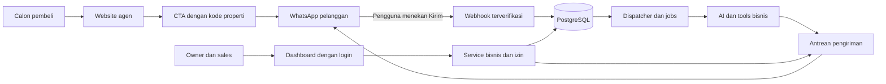

# Struktur folder — Website Agen dan AI Admin Properti

Tanggal: 3 Oktober 2026  
Status: target struktur implementasi; sebagian folder/kode sudah dibuat pada milestone lokal 3 Oktober 2026. Status aktual ada di [docs/implementation-status.md](./docs/implementation-status.md).  
Acuan: [plan shipping demo](./plan-ship-demo-ai-admin-properti.md).  
Pasangan dokumen: [desain database](./desain-database-ai-admin-properti.md).

## 1. Bentuk aplikasi

Satu proyek Next.js + TypeScript menyediakan website agen, dashboard internal, endpoint WhatsApp, dan handler pekerjaan Inngest. Database, Auth, serta Storage memakai Supabase. Pekerjaan berjalan melalui layanan jobs, bukan proses yang dibiarkan hidup setelah respons HTTP selesai.

Model usaha adalah jasa maintenance untuk klien agen/agensi. Demo melayani satu klien; organisasi kedua hanya untuk menguji isolasi. Tidak ada modul paket SaaS, checkout, onboarding mandiri, atau marketplace lintas agensi.



Website mengambil katalog publik dari sumber data yang sama dengan AI. Pengunjung tidak masuk ke dashboard; CTA membuka WhatsApp. Klik CTA dan pesan yang benar-benar masuk merupakan dua peristiwa berbeda.

## 2. Pohon folder target

Nama file berikut adalah usulan konkret untuk implementasi bertahap, bukan kewajiban membuat semua folder kosong pada P1. Contoh route mengikuti Next.js App Router; route group `(public)` dan `(auth)` tidak menjadi bagian URL. [Referensi struktur Next.js](https://nextjs.org/docs/app/getting-started/project-structure)

```text
ai-admin-properti/
├── plan-ship-demo-ai-admin-properti.md
├── struktur-folder-ai-admin-properti.md
├── desain-database-ai-admin-properti.md
├── README.md
├── package.json
├── package-lock.json
├── next.config.ts
├── tsconfig.json
├── eslint.config.mjs
├── postcss.config.mjs
├── .env.example
├── .gitignore
├── .github/
│   └── workflows/
│       └── checks.yml
├── public/
│   └── brand/                         # Logo/aset statis yang memang publik
├── docs/
│   ├── demo-script.md
│   ├── deployment.md
│   ├── maintenance.md
│   └── decisions/                    # Keputusan yang memengaruhi implementasi
├── src/
│   ├── app/
│   │   ├── layout.tsx
│   │   ├── globals.css
│   │   ├── not-found.tsx
│   │   ├── robots.ts
│   │   ├── sitemap.ts
│   │   ├── (public)/
│   │   │   ├── layout.tsx
│   │   │   ├── page.tsx              # /
│   │   │   ├── properti/
│   │   │   │   ├── page.tsx          # /properti
│   │   │   │   └── [slug]/
│   │   │   │       └── page.tsx      # /properti/[slug]
│   │   │   └── privasi/
│   │   │       └── page.tsx
│   │   ├── (auth)/
│   │   │   └── login/
│   │   │       └── page.tsx
│   │   ├── auth/
│   │   │   └── callback/
│   │   │       └── route.ts
│   │   ├── app/                     # Segmen URL /app, dashboard internal
│   │   │   ├── layout.tsx
│   │   │   ├── page.tsx             # Ringkasan Hari Ini sesuai peran
│   │   │   ├── loading.tsx
│   │   │   ├── error.tsx
│   │   │   ├── inbox/
│   │   │   │   ├── page.tsx
│   │   │   │   └── [conversationId]/page.tsx
│   │   │   ├── prospek/
│   │   │   │   ├── page.tsx
│   │   │   │   └── [leadId]/page.tsx
│   │   │   ├── properti/
│   │   │   │   ├── page.tsx
│   │   │   │   ├── baru/page.tsx
│   │   │   │   └── [propertyId]/page.tsx
│   │   │   ├── survei/page.tsx
│   │   │   ├── tugas/page.tsx
│   │   │   ├── pengetahuan/page.tsx
│   │   │   └── pengaturan/page.tsx
│   │   └── api/
│   │       ├── webhooks/whatsapp/route.ts
│   │       ├── inngest/route.ts
│   │       ├── public/
│   │       │   ├── metrics/route.ts
│   │       │   └── property-assets/[assetId]/route.ts
│   │       └── internal/
│   │           ├── conversations/[conversationId]/messages/route.ts
│   │           └── simulator/messages/route.ts
│   ├── proxy.ts                     # Refresh sesi; konvensi Next.js 16
│   ├── components/
│   │   ├── ui/                      # Button, input, dialog, table
│   │   ├── public/                  # Header, footer, CTA WhatsApp
│   │   └── admin/                   # Sidebar, shell, role badge
│   ├── modules/
│   │   ├── site/                    # Profil website, metadata, katalog publik
│   │   ├── properties/
│   │   │   ├── components/
│   │   │   ├── schemas.ts           # Validasi input
│   │   │   ├── types.ts             # Tipe aman untuk UI
│   │   │   ├── actions.ts           # Server Actions untuk mutasi UI
│   │   │   ├── queries.ts           # Read model/DTO untuk halaman
│   │   │   ├── service.ts           # Aturan listing dan publikasi
│   │   │   └── repository.ts        # Query/RPC database
│   │   ├── knowledge/              # FAQ publik
│   │   ├── leads/                  # Preferensi, tahap, assignment
│   │   ├── inbox/                  # Ingest, handoff, balasan manusia
│   │   ├── surveys/                # Pengajuan, konfirmasi, hasil kunjungan
│   │   ├── tasks/                  # Follow-up dan penanganan kegagalan
│   │   ├── dashboard/              # Metrik dari record bisnis
│   │   ├── settings/               # Konfigurasi klien, pause, reset demo
│   │   └── analytics/              # Agregat klik CTA tanpa identitas pembeli
│   ├── server/
│   │   ├── env.ts                  # Validasi secret dan konfigurasi server
│   │   ├── auth/
│   │   │   ├── session.ts
│   │   │   ├── actor-context.ts     # User/system dan organisasi terverifikasi
│   │   │   └── permissions.ts
│   │   ├── db/
│   │   │   ├── user-client.ts      # Sesi pengguna; RLS berlaku
│   │   │   ├── system-client.ts    # Server-only; operasi sistem terbatas
│   │   │   └── rpc.ts              # Pembungkus transaksi database
│   │   ├── integrations/
│   │   │   ├── ai/
│   │   │   │   ├── client.ts
│   │   │   │   ├── prompts.ts
│   │   │   │   ├── tools.ts
│   │   │   │   └── schemas.ts
│   │   │   ├── whatsapp/
│   │   │   │   ├── client.ts
│   │   │   │   ├── verify-signature.ts
│   │   │   │   ├── normalize-event.ts
│   │   │   │   └── delivery-status.ts
│   │   │   ├── simulator/
│   │   │   │   └── adapter.ts
│   │   │   └── storage/
│   │   │       └── property-assets.ts
│   │   ├── conversations/
│   │   │   ├── coordinator.ts      # Urutan kerja dan koordinasi handoff/send
│   │   │   └── send-gate.ts        # Validasi sebelum mulai request provider
│   │   ├── jobs/
│   │   │   ├── client.ts
│   │   │   ├── registry.ts
│   │   │   ├── dispatch-pending.ts
│   │   │   ├── process-message.ts
│   │   │   ├── send-outbox.ts
│   │   │   ├── process-status.ts
│   │   │   └── recover-stalled.ts
│   │   └── observability/
│   │       ├── logger.ts
│   │       └── audit.ts
│   ├── lib/
│   │   ├── money.ts
│   │   ├── time.ts
│   │   └── whatsapp-link.ts        # Helper URL; tidak berisi secret
│   └── types/
│       └── database.generated.ts   # Dihasilkan dari schema Supabase
├── supabase/
│   ├── config.toml
│   ├── migrations/
│   │   └── <timestamp>_<change>.sql
│   ├── seed.sql                    # Data sintetis; tidak menyimpan password
│   └── tests/
│       ├── access.test.sql
│       ├── integrity.test.sql
│       └── scheduling.test.sql
├── scripts/
│   ├── seed-demo.ts                # Membuat akun lewat Auth Admin API
│   └── reset-demo.ts               # Memverifikasi target organisasi demo
└── tests/
    ├── fixtures/                   # Payload provider tersamarkan, skenario AI
    ├── integration/                # Ingest, retry, ordering, handoff, outbox
    └── e2e/                        # Website, peran, inbox, survei, reset
```

Modul lain mengikuti pola `properties` hanya ketika dibutuhkan. Tidak perlu menambahkan `service.ts` kosong pada modul yang hanya berisi query sederhana. Gunakan satu package manager dan satu lockfile; contoh ini memakai npm.

## 3. Tanggung jawab dan batas import

| Lapisan | Tugas | Batas |
| --- | --- | --- |
| `app` | Routing, layout, halaman, penerimaan HTTP | Tidak menampung prompt AI, query kompleks, atau aturan assignment. |
| `components` | Komponen tampilan yang dipakai ulang | Menerima DTO aman; tidak mengimpor client rahasia atau repository server. |
| `modules/*/actions.ts` | Memvalidasi input dan actor, lalu memanggil service | Setiap action melakukan otorisasi; keberadaan tombol/layout bukan kontrol izin. |
| `modules/*/service.ts` | Aturan bisnis dan koordinasi transaksi | Digunakan bersama oleh UI, AI tools, simulator, dan jobs. |
| `modules/*/repository.ts` | Query dan RPC dengan scope organisasi | Tidak menerima organisasi mentah dari browser sebagai identitas tepercaya. |
| `server/integrations` | Protokol provider serta normalisasi payload | Tidak menjadi tempat aturan tahap prospek atau hak akses sales. |
| `server/jobs` | Menjalankan pekerjaan tersimpan dan pemulihan | Payload berisi ID; baca ulang mode, versi, izin, serta status dari database. |
| `server/conversations` | Koordinasi per percakapan | Berlaku pada AI, balasan manusia, retry, dan handoff; bukan mutex lokal per instance. |
| `lib` dan `types` | Helper murni dan tipe yang aman dibagikan | Tidak menyimpan secret atau membuat koneksi database. |

Alur import utama: **halaman/action/job → service → repository/RPC atau adapter provider**. Repository tidak mengimpor UI. AI tools hanya memanggil service yang sudah dibatasi; model tidak diberi akses SQL bebas.

Tandai modul server dengan `server-only`; gunakan directive Server Actions pada batas action. Hindari satu barrel export yang mencampur helper browser dengan secret/server client.

## 4. Route dan akses

| Route | Akses | Perilaku |
| --- | --- | --- |
| `/`, `/properti`, `/properti/[slug]`, `/privasi` | Pengunjung | Hanya profil/field publik dan listing aktif terpublikasi. |
| `/login`, `/auth/callback` | Alur Auth | Tidak memberikan izin bisnis sebelum identitas dan membership diverifikasi. |
| `/app/**` | Owner/sales aktif | Query memakai actor dan organisasi; sales dibatasi assignment. |
| `/api/internal/**` | Sesi sah + izin tindakan | Polling pesan dan simulator; simulator hanya pada lingkungan demo. |
| `/api/webhooks/whatsapp` GET | Meta verification | Verifikasi challenge/token; tidak membuat prospek. |
| `/api/webhooks/whatsapp` POST | Signature provider valid | Membaca body asli, memetakan kanal, menyimpan event dan pekerjaan secara atomik. |
| `/api/inngest` | Mekanisme autentikasi/signature Inngest | Handler jobs; tidak mengikuti login browser, tetap terproteksi sesuai SDK. |
| `/api/public/metrics` | Pengunjung, dibatasi request | Counter CTA terkontrol; tidak membuat kontak/lead. |
| `/api/public/property-assets/[assetId]` | Pengunjung, hanya aset listing terpublikasi | Memeriksa publikasi/organisasi setiap request sebelum mengirim gambar. |

Mutasi dashboard dilakukan melalui Server Actions; jangan membangun API REST kedua untuk tindakan yang sama tanpa kebutuhan. `proxy.ts` membantu sesi, sedangkan otorisasi tetap di server/service/RLS. Validasi identitas menggunakan mekanisme terverifikasi seperti `getClaims()` atau `getUser()` sesuai kebutuhan; data sesi yang belum diverifikasi tidak cukup. [Panduan Supabase SSR](https://supabase.com/docs/guides/auth/server-side/nextjs)

## 5. Alur satu pesan

1. `site/queries.ts` mengambil DTO listing publik. `whatsapp-link.ts` menyusun nomor tujuan dan teks dengan kode properti; tidak mengirim pesan.
2. Setelah pelanggan menekan Kirim, handler WhatsApp memverifikasi signature dan menormalisasi setiap item event.
3. Service ingest memanggil transaksi `ingest_inbound_message`: deduplikasi, kontak/lead/percakapan, nomor urut pesan, `webhook_events`, dan `job_outbox`. Status provider memakai jalur transaksi event/status tersendiri. Detailnya ada pada desain database.
4. Dispatcher menerbitkan ID pekerjaan yang sudah tersimpan ke Inngest. Pemulihan berkala menemukan pekerjaan yang belum terbit atau belum selesai.
5. `process-message.ts` memperoleh giliran percakapan, memeriksa mode/versi, menjalankan AI tools melalui service, dan menyimpan hasil.
6. Balasan yang valid masuk ke `messages` dan `outbox` dalam satu transaksi. `send-outbox.ts` memakai send gate bersama handoff sebelum memulai request provider.
7. Delivery webhook memperbarui status pengiriman tanpa membuat lead baru atau memanggil AI lagi. Polling inbox membaca DTO pesan berdasarkan izin pengguna.

Simulator masuk melalui service ingest yang sama dengan envelope simulator; endpoint simulator tetap memerlukan login dan tidak memalsukan signature/provider ID WhatsApp. Kontaknya memakai identitas sintetis agar tidak tercampur dengan nomor nyata.

## 6. Konfigurasi, publikasi, dan data rahasia

- `SITE_ORGANIZATION_ID` mengikat satu deployment website ke satu organisasi. Host publik/canonical diverifikasi terhadap konfigurasi server; query string atau kode properti tidak menentukan identitas organisasi.
- `.env.example` memuat nama variabel dan petunjuk. Secret database, AI, Meta, serta jobs hanya dibaca `server/env.ts`; variabel yang dikirim ke browser dibatasi konfigurasi publik.
- `system-client.ts` digunakan hanya pada operasi sistem yang membutuhkan hak tinggi, dalam fungsi berparameter terkontrol. Query dashboard normal menggunakan sesi pengguna agar RLS ikut menegakkan izin. Secret Supabase dapat melewati RLS, sehingga batas organisasi harus diperiksa pada operasi sistem. [Dokumentasi Supabase RLS](https://supabase.com/docs/guides/database/postgres/row-level-security)
- Foto listing disimpan di bucket privat, bukan `public/`. Jalur gambar website memeriksa publikasi sebelum menampilkan foto; hindari URL bucket publik yang tetap membuka foto setelah listing ditarik. Jangan cache respons gambar/HTML privat secara bersama. Rancangan akses aset dirinci pada dokumen database.
- Untuk demo awal, baca katalog/harga secara dinamis tanpa cache lintas request. Jika caching ditambahkan, publikasi, harga, dan status harus memiliki invalidasi teruji; metadata dan sitemap mengikuti aturan yang sama.
- Halaman sintetis/demo memakai `noindex`. Rilis SEO klien menggunakan data nyata yang diizinkan, canonical sesuai domain klien, dan sitemap khusus halaman publik.
- `logger.ts` mencatat ID operasi, status, durasi, serta kode error. Isi chat lengkap dan nomor kontak tidak dicetak ke log operasional.

## 7. Implementasi bertahap

| Tahap plan | Folder yang dibangun | Titik pemeriksaan |
| --- | --- | --- |
| P0–P1 | `app`, `components/ui`, `server/env`, README/config | Tampilan dasar dan build lokal berjalan. |
| P1a | Handler WhatsApp dan adapter minimum | Uji kanal dua arah tanpa AI. |
| P2 | Auth, DB client/RPC, migrations, seed, tes akses | Owner/sales login dan isolasi data lulus. |
| P3–P3a | `properties`, `knowledge`, `site`, storage, analytics | Listing tersimpan, website/CTA benar, data internal tertutup. |
| P4–P5 | `leads`, `inbox`, `surveys`, `tasks`, `dashboard` | Alur simulator sampai follow-up bekerja. |
| P6–P7 | Adapter AI, tools, coordinator, jobs, outbox | AI live dan WhatsApp lengkap; retry/handoff teruji. |
| P8 | E2E, deployment/maintenance runbook | Demo ter-host dapat diulang dua kali. |

Script yang ditargetkan: `dev`, `typecheck`, `lint`, `build`, `test`, `test:db`, `test:e2e`, dan `db:types`. Pipeline memeriksa perubahan dengan fixture; panggilan AI/WhatsApp live dijalankan terpisah memakai akun uji yang diizinkan.

## 8. Batas keputusan dokumen

Struktur ini adalah desain, belum scaffold aplikasi. Versi dependency dikunci ketika P1 dimulai. Koordinasi pengiriman/handoff lintas instance dan mapping callback status provider harus dibuktikan melalui pengujian integrasi sebelum dinyatakan memenuhi plan. Migrasi database disusun dari [dokumen desain database](./desain-database-ai-admin-properti.md), bukan dari diagram folder saja.
